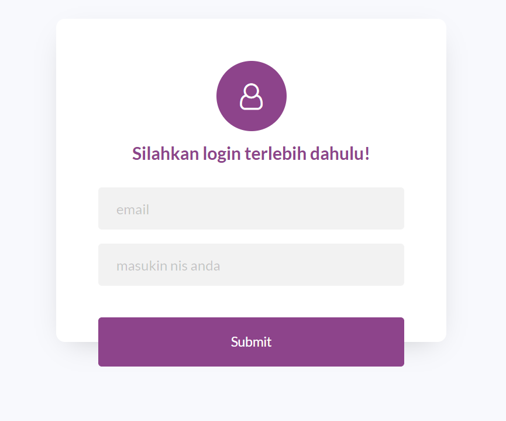
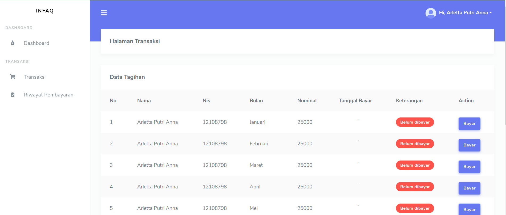
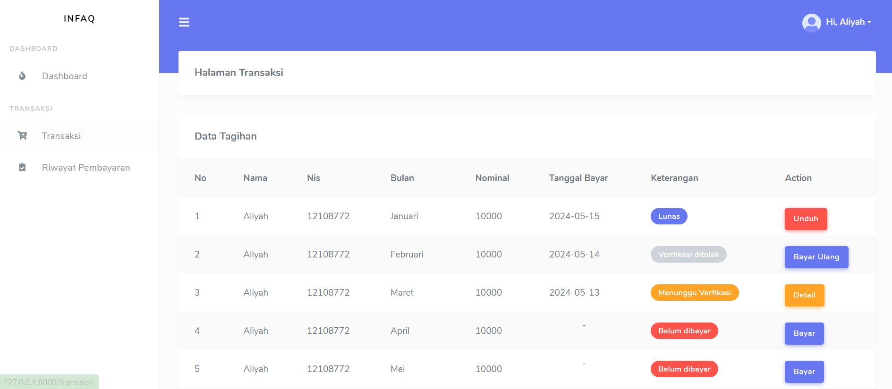
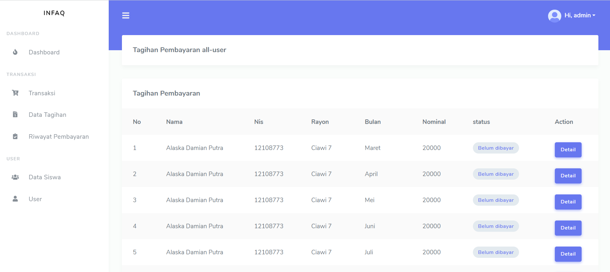
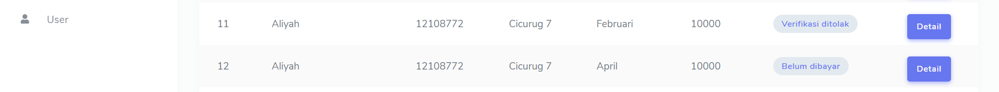
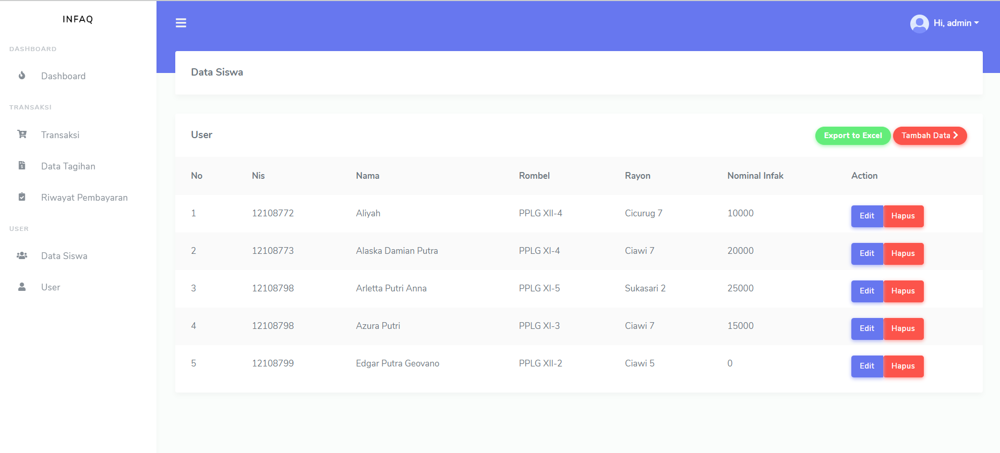
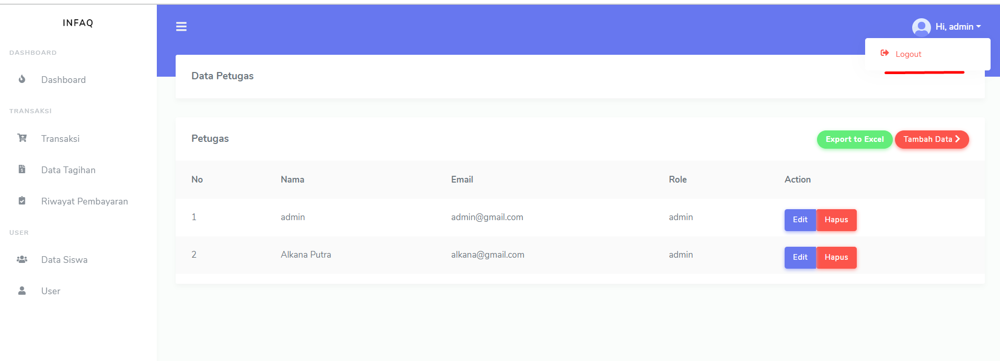

## screenshoot hasil project

## Login 
  Penjelasan: Ini adalah halaman login dari aplikasi, di mana pengguna harus memasukkan email dan NIS pengguna sebagai password untuk masuk.

  

## Dashboard
- Admin

    
- User 

    

## Transaksi | Admin 

- Transaksi 
    -  Penjelasan: Halaman ini menampilkan daftar transaksi pengguna yang perlu diverifikasi oleh admin.

  

- Detail
    - Penjelasan: Halaman ini digunakan oleh admin untuk memverifikasi pembayaran pengguna.

    
    
## Transaksi | User

- Transaksi 
    - Jika user belum memiliki nominal infaq untuk dibayarkan setiap bulannya, maka user harus mengisi form nominal perjanjian infaq terlebih dahlu

    

- Form Pengisian Nominal Perjanjian Infaq
  1. Pada halaman perjanjian pembayaran, isi formulir dengan data yang diperlukan: Jumlah infaq yang akan dibayar setiap bulannya.

  

  2. Setelah mengisi semua data yang diperlukan, klik tombol "Save changes".
  3. Perjanjian pembayaran Anda akan tersimpan dan akan muncul data tagihan pembayaran infaq Anda.

  

  **Note**: Untuk User yang sudah mengisi nominal perjanjian Infaknya dan sudah melakukan pembayaran

  

- Form Pembayaran infaq
  1. Pilih bulan yang akan dibayar. Di halaman Transaksi, pilih bulan yang ingin Anda selesaikan pembayarannya, lalu klik button “Bayar”
  2. Ikuti instruksi yang diberikan untuk melakukan pembayaran. Pastikan Anda melakukan pembayaran sesuai dengan jumlah yang telah disepakati.
  3. Setelah mengisi semua data yang diperlukan, klik tombol “Bayar”. 
     Halaman akan kembali ke halaman transaksi, status pembayaran akan berubah menjadi "Menunggu Verifikasi".
     Anda dapat menunggu verifikasi dari admin apakah diterima atau ditolak. 
  4. Admin akan memverifikasi pembayaran Anda.
     Setelah pembayaran diverifikasi, status pembayaran akan berubah menjadi "Lunas".
     Jika pembayaran di tolak, status pembayaran akan berubah menjadi “Verifikasi ditolak”. Dan Anda perlu melakukan upload bukti pembayaran 

     

- Unduh Bukti Pembayaran
    - Anda juga memiliki opsi untuk mengunduh data pengguna yang telah melunasi pembayaran infaq ke dalam format file PDF, yang menampilkan data infaq yang sudah lunas per bulan. Berikut langkahnya:
   1. Buka halaman Transaksi/Riwayat Transaksi 
   2. Klik Tombol Unduh
        - Pada halaman tersebut, klik tombol "Unduh".
        - File PDF yang berisi data pengguna dan infaq yang sudah lunas per bulan akan diunduh secara otomatis.

      

## List Data Tagihan | Admin 
    Penjelasan: Mencakup semua data user yang pembayarannya belum dibayar dan atau verifikasi ditolak.

   
   

## List Riwayat Pembayaran 
- Admin 
    - **Note:** Data yang ditampilkan adalah data semua pengguna yang sudah melunasi pembayaran infaq mereka.

  

- User 
    - **Note:** Data yang ditampilkan adalah data pengguna yang sudah melunasi pembayaran infaq mereka.

  

## Data Siswa | Admin
    Penjelasan: Halaman ini digunakan oleh admin untuk melihat dan mengelola data siswa. Admin dapat menambahkan, mengedit, atau menghapus data siswa sesuai kebutuhan.

   

 - Create data siswa
    - Penjelasan: Halaman ini digunakan oleh admin untuk menambahkan data siswa baru ke dalam sistem.
    - Untuk password siswa akan otomatis terbuat menggunakan NIS dari user.

    

 - Edit data siswa
    - Penjelasan: Halaman ini digunakan oleh admin untuk mengedit data siswa yang sudah ada.

    

## Data Petugas | Admin
    Penjelasan: Halaman ini digunakan oleh admin untuk melihat dan mengelola data petugas. Admin dapat menambahkan, mengedit, atau menghapus data petugas sesuai kebutuhan.

   

  - Create Data Petugas
    - Penjelasan: Halaman ini digunakan oleh admin untuk menambahkan data petugas baru ke dalam sistem.

    

  - Edit Data Petugas
    - Penjelasan: Halaman ini digunakan oleh admin untuk mengedit data petugas yang sudah ada.

    

## Logout 
    -Untuk logout, Anda dapat melihat di bagian atas kanan layar dan klik pada nama Anda. Opsi logout akan tersedia setelahnya.
  

